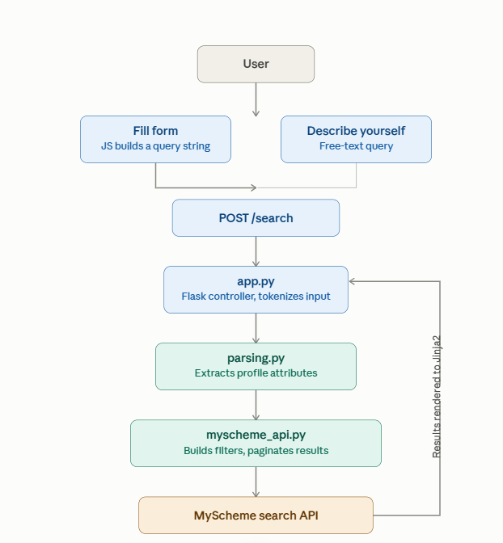
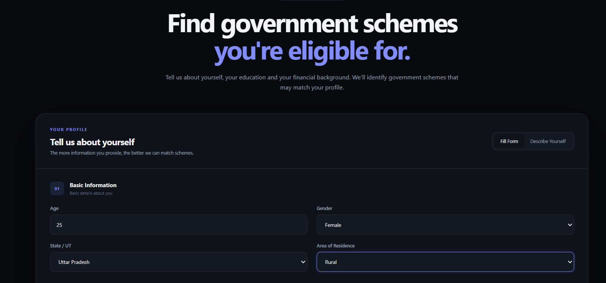
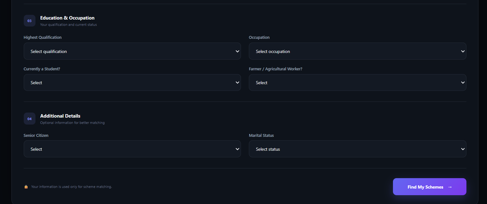
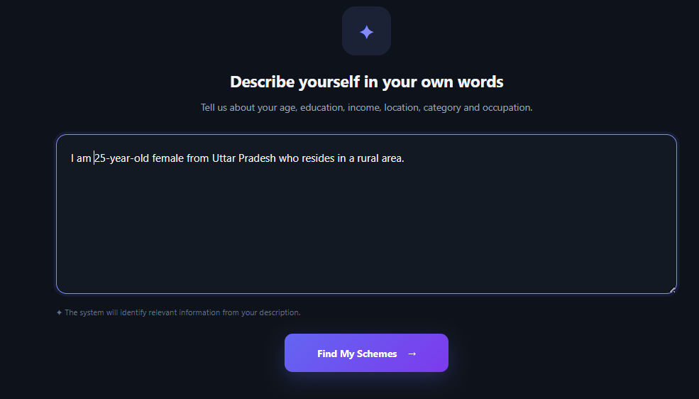

# Government Scheme Finder

## Overview

The Government Scheme Finder is a Flask-based web application that helps users discover Indian government welfare schemes relevant to their personal profile. It accepts input either through a structured form or a free-text description, extracts eligibility attributes using rule-based parsing, and queries the official MyScheme search API to return matching schemes in real time.

## Key Features

- Personalized scheme recommendations based on user profile
- Dual input modes — structured form and natural-language description
- Automatic extraction of gender, age, state, category, residence, BPL, disability, and senior-citizen status
- Live integration with the MyScheme government API
- Automatic pagination across all matching results
- Fault-tolerant fetching — partial results returned even if a page request fails
- Dark and light theme support

## System Architecture

### Tech Stack

- Python
- Flask
- Requests
- Jinja2
- HTML, CSS, JavaScript
- MyScheme Search API

### Architecture Diagram



## Project Structure
```text
Government-Scheme-Finder/
├── app.py
├── parsing.py
├── myscheme_api.py
├── templates/
│   └── index.html
├── static/
│   └── style.css
├── document/
│   ├── diagrams/
│   │   ├── coverpage.png
│   │   ├── flow.png
│   │   ├── input.png
│   │   ├── moreinput.png
│   │   ├── prompt.png
│   │   └── schemes.png
│   └── report_doc.pdf
├── README.md
├── LICENSE
└── .gitignore
```


## How to Run

1. Clone the repository and check out the correct branch

```bash
git clone https://github.com/harsh-sharma-26/scraper.git
cd scraper
git checkout main
```

2. Create and activate a virtual environment

```bash
python -m venv venv
source venv/bin/activate
```

3. Install dependencies

```bash
pip install flask requests
```

4. Set the MyScheme API key

```bash
export MYSCHEME_API_KEY="your_api_key_here"
```

5. Run the application

```bash
python app.py
```

6. Open in browser
 <href>http://127.0.0.1:5000</href>
 
## Sample Query

Enter the following in the "Describe Yourself" mode:
I am 25-year-old female from Uttar Pradesh who resides in a rural area.
## Screenshots
Home Page

Input Form

Query as a Prompt

Scheme Results


